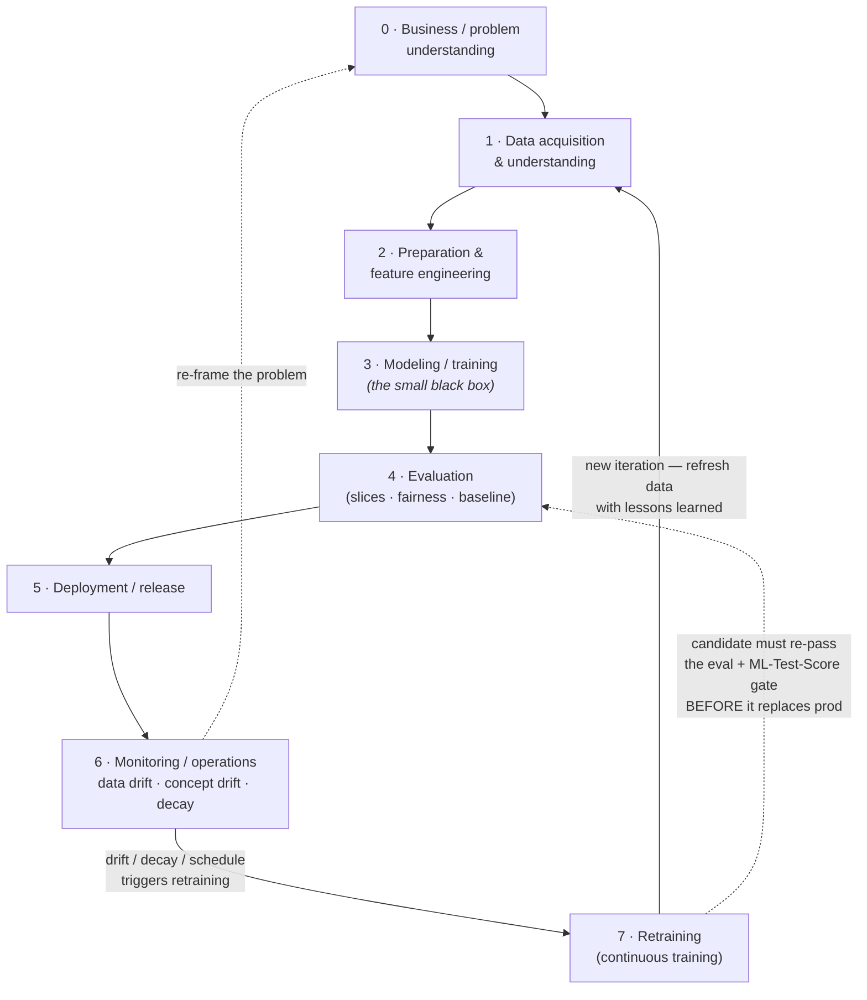

# Lesson 9.4 — The ML / data-science lifecycle

> _You don't build a chair, you tend a garden — the seed (the model) is the smallest part; the soil, water, and weekly weeding are the job._

_TL;DR: When you **train a model from data**, the artifact is *learned*, so the lifecycle is an explicit **loop** — build → deploy → monitor → retrain — not a line that ends at "ship." The work is **data-centric** (the trained model is a tiny fraction of a real ML system [^4]), and the loop closes because the world moves under the model: **data drift**, **concept drift**, and silent **performance decay** [^6]._

## Map only — we are not automating yet
_This phase **maps** the lifecycle you'll later automate with agents; here we just name the stages and the arrows [^1][^3]._

This is a model-*training* project (you learn the artifact from data), which is **not** a generic software SDLC. Two foundational *process* models — **CRISP-DM** (6 phases, cyclical) [^1] and Microsoft's **TDSP** (5 iterative stages, ending in Customer Acceptance) [^2] — define the build-and-iterate stages. The *operations* canon — Google's **MLOps** maturity model [^3], Sculley et al. on hidden ML technical debt [^4], Breck et al.'s ML Test Score [^5], and Gama et al. on concept drift [^6] — defines what makes it survive in production.

## The lifecycle as a loop
_Eight stages where the last feeds the first; deployment is the **midpoint**, not the finish line [^1][^3]. (The 8-stage numbering is a synthesis — CRISP-DM has 6 phases [^1] and TDSP 5 [^2] — aligned with the MLOps operations canon [^3].)_

The entire *point* is the **outer loop**: most curricula stop at "deploy" and present this as a one-way pipeline [^1]. A senior practitioner treats deployment as the **middle**, not the end — the moment a model ships, the maintenance clock starts ticking [^6].

## Stage by stage — WHAT / WHY / HOW
_Each stage exists to de-risk the next; the data stages carry the most leverage and the most failure modes [^4]._

| # | Stage — WHAT | WHY it matters | HOW (the move) |
|---|---|---|---|
| 0 | **Business understanding** — define objective, success metric, and whether ML is even right | Most ML failures are **framing** failures: wrong problem, or no labels/feedback to learn or monitor from | CRISP-DM Ph.1 / TDSP "Business Understanding": target variable, KPIs, a **non-ML baseline**, data-availability check [^1][^2] |
| 1 | **Data acquisition & understanding** — source, ingest, profile, assess | Data dependencies cost more than code dependencies and **erode silently** [^4]; garbage data caps quality regardless of algorithm | Data profiling, lineage, **data validation as a gated step** [^1][^2] |
| 2 | **Preparation & feature engineering** — clean, transform, label, engineer | Usually the **highest-leverage, most time-consuming** stage; **training-serving skew** (features computed differently offline vs. online) is a top silent bug [^9] | Reproducible pipelines, data versioning, **feature stores** to guarantee train/serve consistency [^7] |
| 3 | **Modeling / training** — pick algorithm, train, tune | The "**small black box**" — important but a minority of the work and risk [^4]; untracked experiments are irreproducible | **Experiment tracking** (params + code + **data version** + env + metrics + artifacts), seed control [^4] |
| 4 | **Evaluation** — assess vs. the business metric, robustness, slices, **fairness** | A model that beats a holdout can still fail on **subpopulations**, be **mis-calibrated**, lose to a trivial baseline, or look good offline yet regress live (**offline↔online metric divergence**) | **Slice + fairness/bias audit** across protected groups, **calibration** checks, temporal (not random) splits, baseline comparison, **ML Test Score** production-readiness rubric (28 tests spanning data, model, infra & monitoring) [^5] |
| 5 | **Deployment / release** — serve behind an interface (batch/online/embedded) | A model in a notebook delivers **zero value**; serving adds latency, versioning, rollback — and you must be able to **re-deploy the exact prior version** and guard against re-introducing a **hidden feedback loop** at release [^4] | CI/CD for the **pipeline** (MLOps Level 1→2), shadow/canary, **model registry + model/data lineage** for reproducible rollback, and a human **approval gate** (governance) before promotion [^3] |
| 6 | **Monitoring / operations** — watch live data quality + drift + decay | The world changes after training; unmonitored models **silently rot**; **hidden feedback loops** make a system self-corrupting [^4]. The hard case: **labels are delayed (weeks) or never arrive** — the **cold-start** problem means you often *can't* measure live accuracy when you need it | Quality metrics **where/when labels exist**; **unsupervised distribution proxies** (KS, PSI) as the early-warning signal **before** labels land; instrument a delayed-label pipeline so accuracy back-fills as ground truth arrives [^8]; drift theory from Gama et al. [^6] |
| 7 | **Retraining / continuous training** — trigger on schedule, drift, or decay | Static models degrade; manual retraining doesn't scale — but **automated** retraining is only safe if every candidate **re-passes the Stage 4 eval gate** before it replaces production | **Continuous Training (CT)** pipelines triggered by monitoring (CT arrives at MLOps Level 1; Level 2 adds CI/CD automation of the pipeline); a retrained model must clear the **same eval + ML Test Score gate (Stage 4)** before promotion — then **back to Stage 1** [^3][^5] |

> 🧠 **Test Yourself:** Live accuracy dropped 8 points overnight. Why is "just retrain on fresh data" the **wrong** default first move?
> 

Answer
The cause might not be the model. It could be a broken upstream pipeline, **training-serving skew** [^9], a hidden **feedback loop** [^4], or label drift — each needs a different fix. Blind auto-retraining on drifted or feedback-contaminated data can **accelerate** decay. Diagnose the *kind* of failure before retraining [^6].

> 🧠 **Test Yourself:** Your CT pipeline retrains nightly and auto-promotes. What two safeguards are missing, and why do they bite hardest under **delayed labels**? 

Answer
(1) A **validation gate**: the candidate must re-pass the **Stage 4 eval + ML Test Score** (incl. slice and calibration checks) *before* it replaces production — auto-promotion without it can ship a regression [^5]. (2) **Lineage + a registry** so you can reproducibly **roll back** to the prior version and avoid re-introducing a feedback loop [^3][^4]. Delayed/missing labels make it worse: you may not have ground truth to even *measure* the new model live for weeks, so promotion leans on offline eval and unsupervised drift proxies, not live accuracy [^8].

## Drift is not one thing
_Beginners conflate four distinct failures; they need different detection and different responses [^6][^8]._

| Failure | What shifts | Detect with | Typical response |
|---|---|---|---|
| **Data drift** | the inputs, P(X) | KS test / PSI on features [^8] | retrain **only if** it moves the decision boundary — shift far from the boundary is virtual drift (see below), no retrain [^6] |
| **Concept drift** | the rule, P(Y\|X) | live accuracy where labels exist [^6][^8] | retrain / re-frame |
| **Virtual drift** | P(X) but **not** the decision boundary | input proxies vs. stable accuracy [^6] | often **no** retraining needed |
| **Pipeline breakage** | upstream data quality | schema / validation checks [^4] | **fix the pipeline**, not the model |

Gama et al. formalize concept drift as a change in the joint P(X, y) and split **real vs. virtual** drift — virtual drift may need no retraining at all [^6]. That distinction is exactly what naive "accuracy dropped → retrain" advice misses.

## Why the model is the small box
_80%+ of real effort and ROI is in data, labeling, and feature pipelines — not algorithm tuning [^4]._

Sculley et al. showed the trained model code is a **tiny fraction** of a real ML system; the bulk is data collection, feature extraction, serving infra, monitoring, and **glue code** [^4]. This is the case for **data-centric** work over model-centric tuning, and it's why **reproducibility** means versioning *code + data + environment + hyperparameters + artifacts* together — not just "set a random seed" [^4].

> 🧠 **Test Yourself:** Your team wants higher accuracy. Per the data-centric view, where do you look first — and why?
> 

Answer
The **data**: quality, labeling consistency, and train/serve feature parity — not the algorithm. The model is the small black box; most leverage lives in the data and feature pipelines around it [^4]. Better data usually beats a better algorithm in practice.

## Your turn (exercise)
Take any model you've trained or seen (a spam filter, a churn predictor, a recommender). On one page, **map all 8 stages as a loop** using the diagram above as a template. For Stage 6, name the *specific* signal that would tell you it's decaying — and classify whether the likely cause is **data drift** (P(X)), **concept drift** (P(Y|X)), or a **broken pipeline** [^6][^8]. Then write the **retraining trigger** for Stage 7: schedule, drift threshold, or performance floor? You've now mapped the loop you'll later automate.

## Where agents fit (teaser)
_Every box and arrow above is a future automation target — but we are only **mapping** here, not building._

Each stage — data validation, feature pipelines, experiment tracking, slice evaluation, drift monitoring, retraining triggers — is something a later module will hand to agents and deterministic loops. The **outer loop itself** (monitor → decide → retrain) is the highest-value thing to automate, because it's the part that never ends. For now, just hold the map: a closed loop, data-centric, with the model as the small box inside a large system [^3][^4].

---
← [Lesson 9.3](03-ai-application-lifecycle.md) · [Phase 9 home](index.md) · → [Check your understanding](quiz.md)

[^1]: [CRISP-DM 1.0: Step-by-step data mining guide](https://public.dhe.ibm.com/software/analytics/spss/documentation/modeler/14.2/es/CRISP-DM.pdf) — Chapman et al., CRISP-DM consortium (NCR, DaimlerChrysler, SPSS, OHRA), 2000 — primary consortium document, IBM/SPSS-hosted (6 phases, cyclical model)
[^2]: [The Team Data Science Process lifecycle](https://learn.microsoft.com/en-us/azure/architecture/data-science-process/lifecycle) — Microsoft Learn / Azure Architecture Center (5 iterative stages incl. Business Understanding + Customer Acceptance)
[^3]: [MLOps: Continuous delivery and automation pipelines in machine learning](https://docs.cloud.google.com/architecture/mlops-continuous-delivery-and-automation-pipelines-in-machine-learning) — Google Cloud (maturity Levels 0/1/2; CI/CD/CT)
[^4]: [Hidden Technical Debt in Machine Learning Systems](https://proceedings.neurips.cc/paper_files/paper/2015/file/86df7dcfd896fcaf2674f757a2463eba-Paper.pdf) — Sculley et al., NeurIPS 2015
[^5]: [The ML Test Score: A Rubric for ML Production Readiness and Technical Debt Reduction](https://research.google/pubs/the-ml-test-score-a-rubric-for-ml-production-readiness-and-technical-debt-reduction/) — Breck et al., IEEE Big Data 2017
[^6]: [A Survey on Concept Drift Adaptation](https://doi.org/10.1145/2523813) — Gama, Žliobaitė, Bifet, Pechenizkiy, Bouchachia, ACM Computing Surveys 46(4), 2014
[^7]: [What is a Feature Store?](https://feast.dev/blog/what-is-a-feature-store/) — Pienaar (Feast) & Del Balso (Tecton), 2021 (feature stores prevent training-serving skew)
[^8]: [What is data drift / concept drift](https://www.evidentlyai.com/ml-in-production/data-drift) — Evidently AI (operational drift definitions; KS / PSI detection)
[^9]: [Rules of Machine Learning (training-serving skew)](https://developers.google.com/machine-learning/guides/rules-of-ml) — Martin Zinkevich, Google
