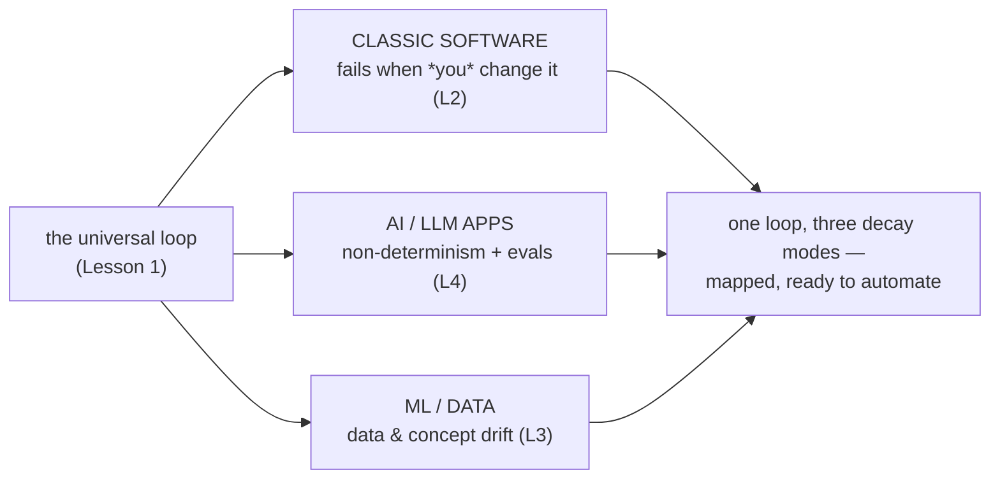

# Phase 9 — Project Lifecycles: the loop you ship into

> **"Done" is not "shipped."** Every technical project runs as a closed feedback loop — frame, plan,
> build, verify, release, operate, learn — whose last stage feeds the first. This phase **maps** that
> loop for classic software, AI/LLM apps, and ML/data systems so a later phase can automate each stage.

## Executive summary
_What this phase makes you able to do, and why it matters._

The most expensive misconception in engineering is **"done = shipped."** Real systems are loops, not
lines: release is the **midpoint**, and most of a system's lifetime cost lives in the
operate/monitor/improve stages [^3]. This phase gives you a single mental model — the **universal
seven-stage loop** — and then shows where the three major build types **diverge**: classic software
fails when *you* change it, while AI/LLM and ML systems can fail when the **world** changes and you
change nothing (data and concept drift) [^1][^2]. You'll see why **evals are the oracle** for
non-deterministic LLM apps [^1], and why **monitoring + retraining** are mandatory loop stages — not
optional ops — for ML systems [^2]. The throughline: **map the lifecycle first, automate it second.**

**Prerequisite:** [Phase 8 — Production Patterns](../08-production-patterns/index.md) (the machinery you operationalize), plus Phase 3 (verification & oracles).

### Learning objectives
By the end of this phase you can:
- **See any project as a loop** — name the seven stages and the feedback edge that closes them.
- **Map the software lifecycle** — requirements→deploy→operate→maintain, made iterative by Agile and automated by DevOps/CI-CD and SRE.
- **Map the ML / data-science lifecycle** — a data-centric build→deploy→monitor→retrain loop that closes because the world drifts under the model.
- **Map the AI application lifecycle** — the normal lifecycle plus non-determinism and a data feedback loop, with **evals as the heartbeat**.

---

## The big idea (in one sentence)

> A technical project is a **garden you tend**, not a **wall you finish** — release is the midpoint of a loop whose last stage feeds the first.

## Lessons (one concept each)

| # | Lesson | The one idea |
|---|---|---|
| 1 | [The lifecycle is a loop](01-the-lifecycle-is-a-loop.md) | "Done" spans creation **and** operation; AI/ML systems can rot with zero code changes because the data moves under them. |
| 2 | [The software lifecycle](02-software-lifecycle.md) | A continuous loop (requirements→deploy→operate→maintain); Agile made it iterative, DevOps/CI-CD fused dev+ops, SRE made ops engineering. |
| 3 | [The ML / data-science lifecycle](03-ml-data-science-lifecycle.md) | A data-centric build→deploy→monitor→retrain loop; the model is the smallest part, and the world drifts under it. |
| 4 | [The AI application lifecycle](04-ai-application-lifecycle.md) | The normal lifecycle plus non-determinism + a data feedback loop; **evals are the oracle** you can't `assertEqual` your way around. |

---

## Phase diagram

---

## Cheatsheet

### Key terms

| Term | What people say | What it actually means |
|---|---|---|
| **Lifecycle loop** | "the dev process" | A closed feedback cycle (frame→…→learn→reframe); the last stage feeds the first [^4]. |
| **Validated learning** | "we shipped it" | The unit of progress in Build-Measure-Learn / PDCA: a measured result fed back into the next iteration [^4]. |
| **Eval (LLM)** | "testing the AI" | The correctness oracle for a non-deterministic system — judges/scorers replacing `assertEqual` [^1]. |
| **Data / concept drift** | "the model got worse" | The world (input distribution or the target relationship) moved under a static model [^2]. |
| **Continuous Training** | "retraining" | The loop-closer for ML: monitoring triggers a retrain on fresh data, not a manual code fix [^2]. |

### Three variants, same loop

| Concern | Classic Software | AI / LLM Apps | ML / Data Science |
|---|---|---|---|
| Primary artifact | Code | Prompt + retrieval + model behavior | Trained model from data |
| Verify means | Tests (deterministic) | **Evaluation** (judges, scorers) [^1] | Offline eval + validation |
| Decay mode | Bugs (static until changed) | Prompt/vendor-model drift [^1] | **Data & concept drift** [^2] |
| Loop-closer | Bugfix/feature → deploy | Re-eval + prompt/data update [^1] | **Continuous Training** — retrain [^2] |

---

→ **[Check your understanding](quiz.md)**

---

← [Phase 8 — Production Patterns](../08-production-patterns/index.md) · [Curriculum home](../index.md) · more topics → [Roadmap](../../roadmap.md)

[^1]: [Your AI Product Needs Evals](https://hamel.dev/blog/posts/evals/) — Hamel Husain (evals are the correctness oracle for non-deterministic LLM apps; the canonical evals reference, also used in Lesson 9.4)
[^2]: [MLOps: Continuous Delivery and Automation Pipelines in Machine Learning](https://docs.cloud.google.com/architecture/mlops-continuous-delivery-and-automation-pipelines-in-machine-learning) — Google Cloud
[^3]: [Hidden Technical Debt in Machine Learning Systems](https://proceedings.neurips.cc/paper_files/paper/2015/file/86df7dcfd896fcaf2674f757a2463eba-Paper.pdf) — Sculley et al., NeurIPS 2015
[^4]: [Plan, Do, Check, Act (PDCA)](https://www.lean.org/lexicon-terms/pdca/) — Lean Enterprise Institute
