# Curriculum — Agent-First Engineering

From "vibe coding" to **systems engineer for agents**. Six foundations phases plus an **Advanced
Patterns** tier, one competency each, taught one concept at a time with diagrams, worked examples, a
hands-on exercise per lesson, and a hard quiz. Agent-agnostic (Claude Code / Codex / Cursor), built on
open standards.

> **Quiz yourself:** in Claude Code (or any agent with the skill installed) run
> `/check-understanding <phase>` — e.g. `/check-understanding context-engineering`. The
> `check-understanding` skill (in the repo under `.claude/skills/`) reads the phase's `quiz.json`
> and runs a fresh interactive quiz, with difficulty selection.

## The progression

```mermaid
flowchart LR
    V[vibe coding] --> P1[P1 · Fundamentals]
    P1 --> P2["P2 · Context Engineering ★★★"]
    P2 --> P3["P3 · Verification & TDD ★★★"]
    P3 --> P4[P4 · Session & Memory]
    P4 --> P5[P5 · Spec-Driven Dev]
    P5 --> P6[P6 · Orchestration & Harness]
    P6 --> S[systems engineer for agents]
    S --> P7["P7 · Advanced Patterns<br/>(encode & automate)"]
```

| # | Phase | You'll be able to… | Scaffolder artifact (lockstep) |
|---|---|---|---|
| 1 | [Fundamentals](01-fundamentals/index.md) | Drive explore→plan→code→commit with specific, context-rich prompts; use plan mode. | the `init` interview UX |
| 2 | [Context Engineering](02-context-engineering/index.md) ★★★ | Treat the context window as scarce: `/clear`, compaction, fresh sessions, spec handoff. | capture-learnings memory loop |
| 3 | [Verification & TDD](03-verification-and-tdd/index.md) ★★★ | Give the agent an external oracle so it closes its own loop. | test-gate / `Stop`-gate hooks |
| 4 | [Session & Memory](04-session-and-memory/index.md) | Course-correct early; author and prune minimal `AGENTS.md`/skills; promote rules to hooks. | `AGENTS.md` + `.agents/skills/` |
| 5 | [Spec-Driven Development](05-spec-driven-development/index.md) | Turn a vague idea into an executable spec; the spec is the source of truth. | Spec Kit hand-off |
| 6 | [Orchestration & Harness](06-orchestration-and-harness/index.md) | Small focused agents, adversarial review, worktrees; design the environment, not the edit. | full guardrail + CI + adapters |
| 7 | [Advanced Patterns](07-advanced-patterns/index.md) **(Advanced)** | Encode the disciplines into machinery: skills, hooks, MCP, security. | the internals of what the scaffolder emits |

★★★ = load-bearing. If you internalize only two phases, make them **2 and 3** — context engineering
and verification carry the most weight across every researched source.

**Capstone (graduation):** run the scaffolder on a real project (or `adopt` an existing one) and
annotate each generated artifact with the phase that taught it. The tool stops being magic and
becomes automation of a process you understand.

---

## Full table of contents

### Phase 1 — [Fundamentals: the agentic loop](01-fundamentals/index.md)
1. [The loop](01-fundamentals/01-the-loop.md) — Explore→Plan→Code→Commit.
2. [Prompt specificity](01-fundamentals/02-prompt-specificity.md) — file, constraint, example, done.
3. [Feeding context](01-fundamentals/03-feeding-context.md) — feed it, don't describe it.
4. [Personas & perspective](01-fundamentals/04-personas-and-perspective.md) — a role aims the view, not the IQ.
5. [Plan mode first](01-fundamentals/05-plan-mode.md) — plan before you build.

### Phase 2 — [Context Engineering ★★★](02-context-engineering/index.md)
1. [The context window is a desk](02-context-engineering/01-context-window-is-a-desk.md) — finite working space.
2. [Context rot](02-context-engineering/02-context-rot.md) — more context can make output worse.
3. [The three moves](02-context-engineering/03-the-three-moves.md) — `/clear`, `/compact`, fresh session.
4. [The spec handoff](02-context-engineering/04-the-spec-handoff.md) — think in one session, implement in a clean one.
5. [What the scaffolder automates](02-context-engineering/05-scaffolder-memory-loop.md) — the capture-learnings memory loop.

### Phase 3 — [Verification & TDD ★★★](03-verification-and-tdd/index.md)
1. ["Looks done" isn't done](03-verification-and-tdd/01-looks-done-isnt-done.md) — without an oracle, you are the loop.
2. [The oracle gradient](03-verification-and-tdd/02-the-oracle-gradient.md) — four strengths of oracle.
3. [TDD with agents](03-verification-and-tdd/03-tdd-with-agents.md) — tests-first is an oracle code can't fake.
4. [Oracles for the un-testable](03-verification-and-tdd/04-oracles-for-the-untestable.md) — screenshot-diffs for UI.
5. [What the scaffolder automates](03-verification-and-tdd/05-scaffolder-test-gate.md) — the `Stop`-gate + post-edit hooks.

### Phase 4 — [Session & Memory Discipline](04-session-and-memory/index.md)
1. [Course-correct early](04-session-and-memory/01-course-correct-early.md) — interrupt drift instantly.
2. [AGENTS.md done right](04-session-and-memory/02-agents-md-done-right.md) — short, imperative, command-first.
3. [Skills, rules & commands](04-session-and-memory/03-skills-rules-commands.md) — when knowledge should surface.
4. [Prose to hooks](04-session-and-memory/04-prose-to-hooks.md) — if it must happen every time, it's a hook.
5. [What the scaffolder automates](04-session-and-memory/05-scaffolder-steering.md) — steering + prose-to-hook promotion.

### Phase 5 — [Spec-Driven Development](05-spec-driven-development/index.md)
1. [Why specs beat prompts](05-spec-driven-development/01-why-specs-beat-prompts.md) — the spec is durable; code is regenerable.
2. [The Spec Kit loop](05-spec-driven-development/02-the-speckit-loop.md) — constitution → specify → plan → tasks → implement.
3. [WHAT vs HOW](05-spec-driven-development/03-what-vs-how.md) — the spec is WHAT; the plan is HOW.
4. [Spec as steering wheel](05-spec-driven-development/04-spec-as-steering-wheel.md) — catch ambiguity on paper.
5. [Scaffolder ↔ Spec Kit handoff](05-spec-driven-development/05-scaffolder-speckit-handoff.md) — the two tools compose.

### Phase 6 — [Orchestration & Harness Engineering ★★★ (capstone)](06-orchestration-and-harness/index.md)
1. [Small, focused agents](06-orchestration-and-harness/01-small-focused-agents.md) — scope kills quality.
2. [Adversarial review](06-orchestration-and-harness/02-adversarial-review.md) — a fresh-context reviewer.
3. [Parallelism & worktrees](06-orchestration-and-harness/03-parallelism-and-worktrees.md) — isolated fan-out.
4. [Harness engineering](06-orchestration-and-harness/04-harness-engineering.md) — enforce with linters + CI.
5. [Defining team direction](06-orchestration-and-harness/05-defining-team-direction.md) — non-negotiables as hooks.
6. [The scaffolder is the capstone](06-orchestration-and-harness/06-scaffolder-capstone.md) — recognize every artifact.

### Phase 7 — [Advanced Patterns: encode & automate](07-advanced-patterns/index.md) *(Advanced tier)*
1. [Anatomy of a Skill](07-advanced-patterns/01-anatomy-of-a-skill.md) — name+description load always; the rest on demand.
2. [Hooks, deep](07-advanced-patterns/02-hooks-deep.md) — deterministic enforcement on lifecycle events; exit 2 blocks.
3. [MCP, deep](07-advanced-patterns/03-mcp-deep.md) — one open protocol; servers expose Tools, Resources, Prompts.
4. [Security & injection](07-advanced-patterns/04-security-and-injection.md) — enforce safety in the harness, not the prompt.
5. [Anatomy of a Subagent](07-advanced-patterns/05-anatomy-of-a-subagent.md) — a focused specialist: own context, own tools, delegated by description.

---

**What's next?** The **Advanced Patterns** tier (Phase 7) is now underway. See the
**[Roadmap](../roadmap.md)** for the full backlog of advanced topics still to come.
