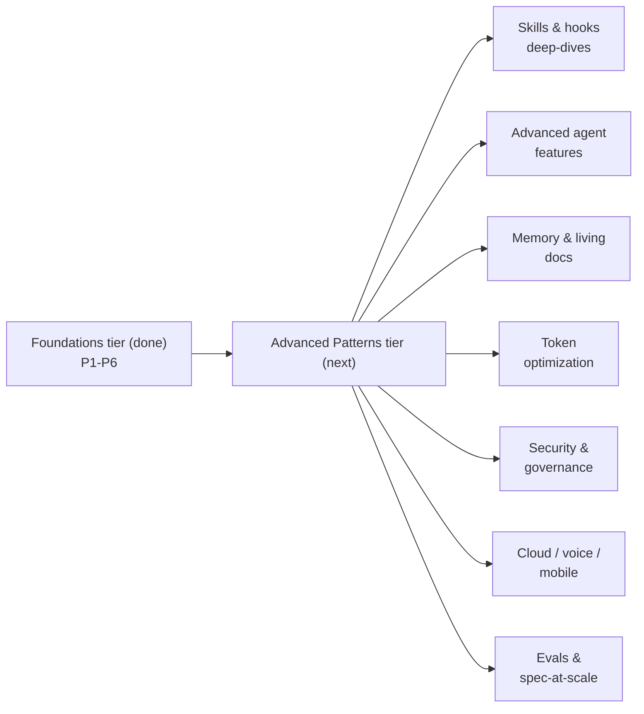

# Roadmap — Advanced Patterns

> _The foundations tier teaches the disciplines. The advanced tier teaches how to **automate** them._

This curriculum's six phases are the **foundations** — the prompting, context, verification, memory,
spec, and orchestration disciplines every agent-first engineer needs. The **Advanced Patterns** tier
(below) builds on them. Its throughline:

!!! quote "The advanced thesis"
    Most advanced "tricks" — prompting patterns, workflow habits, review rituals — are **best
    practices you should encode and automate** with hooks, skills, instructions, and CI rather than
    perform by hand. The foundations teach the practice; the advanced tier teaches the **automation
    and the systems** around it.

**Maturity legend:** 🟢 **Teach-now** (shipping, stable) · 🟡 **Emerging** (real but moving fast) ·
🔴 **Bleeding-edge** (early/experimental). This is a living document — topics graduate into full
lessons over time.

---

## Next up — the Advanced tier (priority)

The seven we'd write first, because they're mature *and* highest-leverage for an agent-first codebase:

1. **Anatomy of a Skill** 🟢 — ✅ **shipped → [Lesson 7.1](curriculum/07-advanced-patterns/01-anatomy-of-a-skill.md)**. `SKILL.md` internals end-to-end: frontmatter, `scripts/`/`references/`/
   `assets/`, progressive disclosure, packaging as plugins. *Skills are how you encode a repeatable
   procedure once and let any agent reach for it.*
   [Agent Skills spec](https://agentskills.io/specification) ·
   [anthropics/skills](https://github.com/anthropics/skills) ·
   [Cursor Skills](https://cursor.com/docs/context/skills)
2. **Hooks, deep** 🟢 — ✅ **shipped → [Lesson 7.2](curriculum/07-advanced-patterns/02-hooks-deep.md)**. Every lifecycle event and handler type; patterns for enforcing rules,
   blocking danger, and reducing approval fatigue. *Hooks are how you make a best practice
   deterministic instead of hopeful.*
   [Claude Code hooks](https://code.claude.com/docs/en/hooks) ·
   [Codex hooks](https://developers.openai.com/codex/hooks) ·
   [Cursor hooks](https://cursor.com/docs/hooks)
3. **MCP, deep** 🟢 — designing Model Context Protocol servers to expose your codebase, data, and
   tools to any agent over one open standard. *The portable way to give agents new capabilities.*
   [MCP specification](https://modelcontextprotocol.io/specification/2025-11-25) ·
   [modelcontextprotocol/modelcontextprotocol](https://github.com/modelcontextprotocol/modelcontextprotocol)
4. **Subagents & multi-agent orchestration** 🟢 — least-privilege subagents, writer/reviewer pairs,
   parallel fan-out, model-per-task. *Scale throughput and quality without flooding one context.*
   [Claude Code subagents](https://code.claude.com/docs/en/sub-agents) ·
   [Cursor agent best practices](https://cursor.com/blog/agent-best-practices)
5. **Security, permissions & sandboxing** 🟢 — permission models, filesystem/network isolation, and
   prompt-injection defense for agents that read untrusted input. *Non-negotiable before autonomy.*
   [Claude Code sandboxing](https://www.anthropic.com/engineering/claude-code-sandboxing) ·
   [OWASP Top 10 for LLM/Agentic Apps](https://genai.owasp.org/)
6. **Prompt & context caching** 🟢 — cache stable prefixes (system prompt, `AGENTS.md`, big files) to
   cut cost and latency on long-running agents. *The cheapest token optimization that exists.*
   [Anthropic prompt caching](https://platform.claude.com/docs/en/build-with-claude/prompt-caching)
7. **Computer use & browser/UI agents** 🟢 — vision + control so agents can test UIs, fill forms, and
   self-verify visually. *Closes the loop for work that has no unit-test oracle.*
   [Anthropic advanced tool use](https://www.anthropic.com/engineering/advanced-tool-use) ·
   [Managed Agents overview](https://platform.claude.com/docs/en/managed-agents/overview)

---

## Backlog — by theme

### Theme 1 · Skills, Hooks & Plugins (extensibility)
| Topic | What & why | Maturity | Source |
|---|---|---|---|
| Plugins & marketplaces | Bundle skills + commands + hooks + agents to share across a team/org | 🟢 | [Agent Skills spec](https://agentskills.io/specification) · [Claude agent skills](https://platform.claude.com/docs/en/agents-and-tools/agent-skills/overview) |
| Skill evals | Measure whether a skill triggers + performs; tune the description | 🟡 | [anthropics/skills](https://github.com/anthropics/skills) |

### Theme 2 · Advanced agent features
| Topic | What & why | Maturity | Source |
|---|---|---|---|
| Background & long-running agents | Multi-hour/day tasks across sessions; the harness that makes them reliable | 🟡 | [Effective harnesses for long-running agents](https://www.anthropic.com/engineering/effective-harnesses-for-long-running-agents) |
| Managed agents | A managed loop + sandbox to run an agent as autonomous infra | 🟡 | [Claude Managed Agents](https://platform.claude.com/docs/en/managed-agents/overview) |
| Plan mode, checkpoints, output styles | Per-agent control surfaces and when each matters | 🟢 | [Claude Code docs](https://code.claude.com/docs) |

### Theme 3 · Memory, learnings & living documentation
| Topic | What & why | Maturity | Source |
|---|---|---|---|
| Structured note-taking | Persist learnings outside the context window so compaction can't lose them | 🟢 | [Effective context engineering](https://www.anthropic.com/engineering/effective-context-engineering-for-ai-agents) |
| Anti-staleness / self-updating docs | Hooks that keep `AGENTS.md` + docs current from real changes; ADRs as specs | 🟡 | [Effective context engineering](https://www.anthropic.com/engineering/effective-context-engineering-for-ai-agents) |

### Theme 4 · Token optimization (open problem)
| Topic | What & why | Maturity | Source |
|---|---|---|---|
| Prompt/context caching | Reuse stable prefixes to cut cost + latency | 🟢 | [Anthropic prompt caching](https://platform.claude.com/docs/en/build-with-claude/prompt-caching) |
| Semantic code indexing / RAG-for-code | Retrieve only the relevant code/docs instead of dumping the repo | 🟡 | [MCP specification](https://modelcontextprotocol.io/specification/2025-11-25) |
| **LLM Wiki in your codebase** | A curated, agent-readable knowledge layer for docs/learnings — kept fresh and token-cheap | 🔴 | _Optional add-on — pending a colleague's open-source release; will be added here as a reference + an optional `scaffold-agent-project` add-on once published._ |

### Theme 5 · Security & governance at scale
| Topic | What & why | Maturity | Source |
|---|---|---|---|
| Sandboxing & permissions | Isolate fs/network; least-privilege tool access | 🟢 | [Claude Code sandboxing](https://www.anthropic.com/engineering/claude-code-sandboxing) |
| Prompt-injection defense | Defend agents that read untrusted files/web/tools | 🟡 | [OWASP Top 10 for LLM/Agentic Apps](https://genai.owasp.org/) |
| Observability, cost control & fleets | Telemetry, spend caps, and managing many agents | 🟡 | [Claude Managed Agents](https://platform.claude.com/docs/en/managed-agents/overview) |

### Theme 6 · Cloud, voice & mobile coding
| Topic | What & why | Maturity | Source |
|---|---|---|---|
| Cloud agents | Delegate to isolated cloud VMs; merge-ready PRs with artifacts | 🟢 | [Cursor Cloud Agents](https://cursor.com/docs/cloud-agent) · [Codex cloud](https://developers.openai.com/codex/cloud) |
| Headless / CI-driven agents | `agent -p` in CI; issue→PR automation | 🟢 | [GitHub Copilot coding agent](https://docs.github.com/copilot/concepts/agents/coding-agent/about-coding-agent) |
| Automated PR review | Agents reviewing PRs with full project context | 🟢 | [Codex GitHub code review](https://developers.openai.com/codex/use-cases/github-code-reviews) |
| Voice & mobile / ticket automation | Code from a phone or by voice; turn tickets into PRs | 🔴 | [Codex web/cloud](https://developers.openai.com/codex/cloud) |

### Theme 7 · Evals & spec-driven at scale
| Topic | What & why | Maturity | Source |
|---|---|---|---|
| Agent evaluation & benchmarking | Measure autonomy/safety so agents don't degrade silently | 🟡 | [SWE-bench](https://www.swebench.com/) |
| Spec-driven development at scale | Specs as the audit trail + source of truth across many agents/teams | 🟡 | [GitHub Spec Kit](https://github.com/github/spec-kit) |

---

## How this grows
Topics graduate from this roadmap into full phases (lessons + diagrams + `quiz.json`) following the
same [authoring rubric](https://github.com/) the foundations used. Each advanced lesson ends, like the
foundations, by showing what the **scaffolder** can generate so you *automate* the pattern rather than
perform it by hand. Suggestions and sources welcome via issues/PRs.
