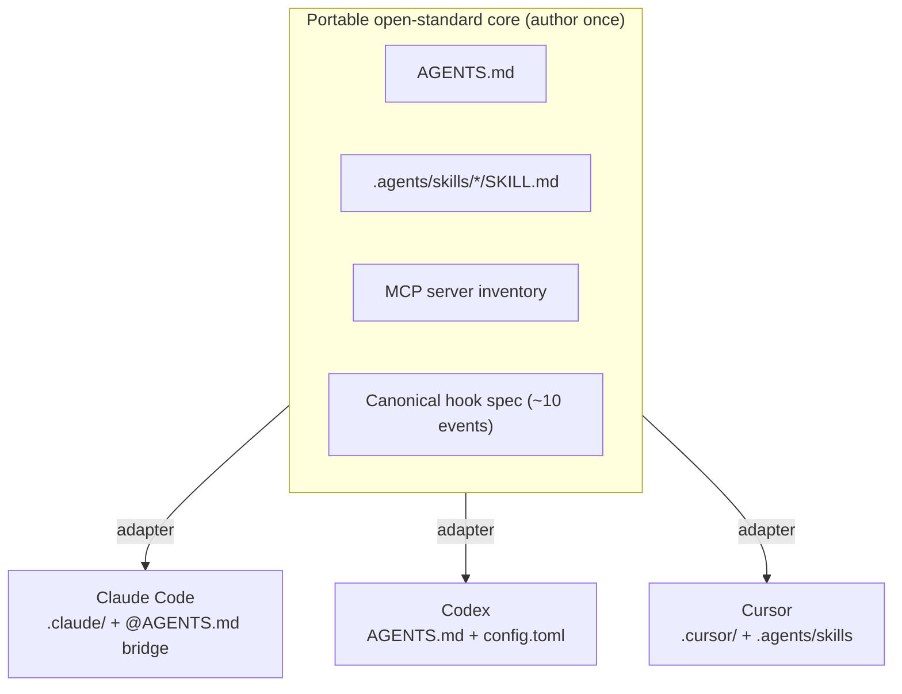

# Claude Code → Codex → Cursor: Feature Translation Matrix

Deep research, current as of **2026-06-01**, across the three target agents. Organized by the
**five layers** of an agent-first repository. For each feature: what it does, the Codex and
Cursor equivalents, how portable it is, and whether it belongs in the **scaffolder** (we
generate it) and/or the **curriculum** (we teach it).

> **Currency caveats** (verify against installed CLI versions before shipping templates):
> Claude's `#` quick-add shortcut is **removed**; Cursor "Memories" was **removed in v2.1.x**
> (folded into Rules); Cursor run-mode names changed in the 3.6 era; Codex `exec` flag
> spellings churn release-to-release; the local `plugin-dev` clone under-reports hook events
> (9 vs the current 32).

---

## Layer 1 — Context & Knowledge (how an agent learns the repo)

| Feature | Claude | Codex | Cursor | Portability | Scaffolder | Curriculum |
|---|---|---|---|---|---|---|
| Primary knowledge file | `CLAUDE.md` (full-loaded at session start) | `AGENTS.md` (native) | `.cursor/rules/*.mdc` + reads root `AGENTS.md` | **High** via AGENTS.md | ✅ | ✅ |
| Hierarchy / precedence | 4 scopes: managed → user `~/.claude` → project → `CLAUDE.local.md`, concatenated, closest wins | global `~/.codex/AGENTS.md` → root→cwd chain, 32 KiB cap | Team > project > user rules | Medium | ✅ | ✅ |
| Nested / monorepo files | subdir `CLAUDE.md` loaded on demand | nested `AGENTS.md`, nearest wins | nested `.cursor/rules` / `AGENTS.md` | High | ✅ | ✅ |
| Import / file-mention | `@path` (max 4 hops, recursive) | **none** | `@file` inside a rule; `@rule-name` to invoke | **Low** | Claude-only | mention |
| Path/glob scoping | `.claude/rules/*.md` with `paths:` frontmatter | directory nesting only | `globs:` frontmatter (Auto-Attached) | Medium | ✅ | ✅ |
| Rule activation modes | always vs path-scoped | always vs nested | 4 modes (Always / Auto-Attached / Agent-Requested / Manual) | Low | Cursor-only | ✅ |
| Bootstrap | `/init` (reads existing AGENTS.md/.cursorrules) | community generators | "Generate Cursor Rules" | Low | tool-specific | ✅ |
| Self-written memory | **auto-memory** (`MEMORY.md` + topic files) | `[memories]` in config.toml | **removed v2.1.x** | None | no (agent-internal) | ✅ concept |

**Portable form the scaffolder emits:** a root **`AGENTS.md`** (plain markdown, **no frontmatter**,
< ~200 lines, command-first) + a thin **`CLAUDE.md` that just does `@AGENTS.md`** (plus optional
Claude-only notes). Per-package nested `AGENTS.md` for monorepos (works in all three).

**Best practices:** command-first not prose; keep < ~200 lines (longer files measurably reduce
adherence); no stale architecture narratives; scope by path instead of bloating the root; add an
entry when the agent repeats a mistake; knowledge files are *guidance* — enforce must-haves via
hooks, not markdown.

---

## Layer 2 — Skills & Commands (packaged, on-demand capability)

| Feature | Claude | Codex | Cursor | Portability | Scaffolder | Curriculum |
|---|---|---|---|---|---|---|
| `SKILL.md` skill (open standard) | native, `.claude/skills/` | native, `.agents/skills/` | native, `.agents/skills/` + `.cursor/skills/` | **High (identical format)** | ✅ core | ✅ core |
| Frontmatter `name`+`description` | required; description drives auto-trigger | same | same (name must match folder) | High | ✅ | ✅ |
| Progressive disclosure (3 levels) | metadata → body → `scripts/`/`references/`/`assets/` | identical | identical | High | ✅ | ✅ core mental model |
| Force manual-only | `disable-model-invocation: true` | installer-curated | `disable-model-invocation: true` | High | ✅ | ✅ (skill vs command) |
| Arguments | `$ARGUMENTS`, `$N`, named | via prompt text | via prompt text | Low | Claude-only | ✅ |
| Dynamic context injection | `` !`cmd` ``, `${CLAUDE_*}` | none | none | None | Claude-only | advanced |
| Legacy commands | `.claude/commands/*.md` (**merged into skills**) | `~/.codex/prompts/*` (**deprecated**) | `.cursor/commands/*` (**`/migrate-to-skills`**) | Medium | no (emit skills) | ✅ migration context |

**The 2026 story:** all three **merged their bespoke command systems into the `SKILL.md` standard.**
`.agents/skills/` is the neutral path honored by **Codex and Cursor**; Claude auto-discovers
`.claude/skills/`. **Scaffolder:** emit canonical `SKILL.md` in `.agents/skills/` and mirror/symlink
into `.claude/skills/` for full three-way coverage; keep Claude-only power features in an optional
overlay.

**Best practices:** Rule = persistent *fact/convention*; Skill = repeatable *procedure* (auto-trigger
on a strong `description`); Command = a skill with `disable-model-invocation` for deliberate/
destructive actions. Description states *what it does AND when to use it*, with concrete trigger
keywords. Body < ~500 lines; push detail into `references/`.

---

## Layer 3 — Automation, Guardrails & Delegation (hooks, subagents)

| Feature | Claude | Codex | Cursor | Portability | Scaffolder | Curriculum |
|---|---|---|---|---|---|---|
| Lifecycle hooks | `settings.json`; **32 events**; 4 handler types | `hooks.json`/`config.toml`; ~11 events (near-port) | `.cursor/hooks.json`; ~20 events incl. Tab | High (Claude↔Codex), Medium (→Cursor) | ✅ generate per-agent | ✅ |
| PreToolUse gating | `permissionDecision: allow/deny/ask`, exit 2 blocks | same fields | `preToolUse` + granular `beforeShellExecution`/`beforeReadFile` | **High** | ✅ flagship | ✅ flagship |
| Post-edit format/lint | `PostToolUse` (Edit\|Write) | `PostToolUse` | `afterFileEdit` | High | ✅ | ✅ |
| Prompt-submit injection | `UserPromptSubmit` → additionalContext | same | `beforeSubmitPrompt` | High | ✅ | ✅ |
| Session bootstrap | `SessionStart` | `SessionStart` | `sessionStart` | High | ✅ | ✅ |
| Compaction | `PreCompact`+`PostCompact` | `PreCompact`+`PostCompact` | `preCompact` (no block, no Post) | High/Medium | ✅ memory loop | ✅ |
| Session end | `SessionEnd` | *(missing — use Stop)* | `sessionEnd` | Medium | optional | — |
| Custom subagents | `.claude/agents/*.md` + Task tool | `.codex/agents/*` (config.toml keys) | custom modes / Task subagents | Medium | ✅ per-agent | ✅ |
| Parallel multi-agent | background agents, agent teams | `agents.max_threads` (6) | **3.2 `/multitask`** + per-agent worktrees | Medium | optional | ✅ |
| Worktree isolation | `isolation: worktree` | per-thread | automatic per-agent worktree | Medium | optional | ✅ |

### Canonical event cross-map (the scaffolder's hook abstraction)

| Canonical | Claude | Codex | Cursor | Fallback if missing |
|---|---|---|---|---|
| `session.start` | `SessionStart` | `SessionStart` | `sessionStart` | first prompt injects context |
| `prompt.submit` | `UserPromptSubmit` | `UserPromptSubmit` | `beforeSubmitPrompt` | — |
| `tool.pre` | `PreToolUse` | `PreToolUse` | `preToolUse`/`beforeShellExecution`/`beforeReadFile` (1→many) | — |
| `tool.post` | `PostToolUse` | `PostToolUse` | `afterFileEdit`/`afterShellExecution` | — |
| `subagent.start` | `SubagentStart` | `SubagentStart` | `subagentStart` | session.start in subagent |
| `subagent.stop` | `SubagentStop` | `SubagentStop` | `subagentStop` | turn.stop |
| `compact.pre` | `PreCompact` | `PreCompact` | `preCompact` | session.start re-inject |
| `compact.post` | `PostCompact` | `PostCompact` | *(missing)* | re-run session.start |
| `turn.stop` | `Stop` | `Stop` | `stop` | last tool.post |
| `session.end` | `SessionEnd` | *(missing)* | `sessionEnd` | turn.stop cleanup |

**Portability trap:** Claude/Codex fail **closed** on exit-2; **Cursor fails open by default** —
set `failClosed: true` on Cursor security hooks. Hooks run in parallel, can't see each other,
non-deterministic order — design independent.

**Best practices:** enforce hard rules in hooks (secret/`.env` read-blocking, dangerous-command
denylist, branch protection, format/lint/typecheck on edit, a `Stop`-gate that refuses to finish
until tests pass); reserve markdown for style/intent. Delegate context-heavy work to least-privilege
subagents that return summaries; route cheap exploration to Haiku; teach the *pattern*, scaffold
per-agent.

---

## Layer 4 — Integration, Control & Ops (the surrounding machinery)

| Feature | Claude | Codex | Cursor | Portability | Scaffolder | Curriculum |
|---|---|---|---|---|---|---|
| MCP servers | `.mcp.json` / `claude mcp add`; 3 scopes | `[mcp_servers]` in config.toml | shared editor+CLI MCP config | **High (open standard)** | ✅ canonical inventory → per-agent | ✅ |
| Tool permissions | `permissions` allow/deny/ask, glob rules | `[execpolicy]` / approval policy | `permissions.json` allowlist | Low/Medium | ✅ baseline per agent | ✅ hygiene |
| Settings hierarchy | 5 tiers, merge, hot-reload | `config.toml` + profiles | `permissions.json`+`settings.json` | Low | per-agent | ✅ concept |
| Approval / run modes | default/acceptEdits/plan/auto/bypass | untrusted/on-request/never | Auto-review / Run-Everything / (legacy Allowlist) | Medium | ✅ sane default | ✅ safety |
| Sandboxing | OS sandbox block (fs/network) | `sandbox_mode` (read-only/workspace-write/full) | sandbox tied to Auto-review | Medium | partial | ✅ |
| Headless / CI | `claude -p`, `--output-format json`, GH Action, SDK | `codex exec --json`, `--output-schema`, GH Action | `cursor-agent -p`, `--output-format`, GH Action | **Medium/High (same idiom)** | ✅ CI template per agent | ✅ |
| Checkpoints / rewind | auto-checkpoint, `/rewind` | none (git + resume) | git/IDE history | Low | no | ✅ + git fallback |
| Context compaction/clear | `/compact`, `/clear` | auto-compact + `/compact` | auto-summarize, new chat | Medium | no (runtime) | ✅ discipline |
| Plan mode / thinking | plan mode + effort low→max | read-only sandbox ≈ plan | Ask/plan flows | Medium | partial | ✅ |
| Output styles / status line | `outputStyle`, `statusLine` | none | none | None | no | optional |

**MCP is the highest-leverage portable artifact in this layer** — one server inventory, re-rendered
per agent. **Best practices:** least privilege (deny secrets/egress, narrow allow, prompt the rest);
never commit YOLO modes; split shared (git) vs personal (gitignored) config; default to plan/read-only
for risky work; `/clear` between tasks; treat checkpoints as convenience, git as the real rollback;
CI = print-mode + JSON + API-key secret + write-gating in a sandboxed, egress-denied container.

---

## Layer 5 — Methodology / Workflows (the pedagogical spine)

The four ecosystems (Anthropic, OpenAI harness engineering, Cursor, 12-factor-agents) **converged on
one spine:** explore → plan → code → verify → commit, ruthless context management, and an external
verification oracle. Universal workflows worth teaching:

1. **Explore → Plan → Code → Commit** — separate *what* from *how*. *(Universal)*
2. **Plan mode first** — read-only plan as a cheap, editable artifact; skip for one-line diffs. *(Universal)*
3. **Verification oracle** — give the agent a pass/fail check so it closes its own loop. *(Universal, highest-leverage)*
4. **TDD with agents** — tests as an oracle that survives long sessions; confirm they fail first. *(Universal)*
5. **Be specific; rich context** — name the file, constraint, example, definition of done. *(Universal)*
6. **Visual/screenshot feedback** for UI work. *(Claude/Cursor)*
7. **Course-correct early** — interrupt drift; cheap rewind licenses risk. *(Universal in spirit)*
8. **Manage context; `/clear` between tasks** — the master constraint. *(Universal)*
9. **Spec handoff** — interview → SPEC.md → fresh session to implement. *(Universal; Spec Kit productizes it)*
10. **Subagents for investigation & adversarial review** — fresh-context reviewer sees only the diff. *(Universal)*
11. **Multi-agent via git worktrees** — isolated parallel sessions. *(Universal)*
12. **Persistent memory (AGENTS.md)** — short, imperative, version-controlled; promote must-haves to hooks. *(Universal)*
13. **Headless / fan-out automation** — `agent -p` over a task list; test small, then scale. *(Conceptually shared)*
14. **Harness engineering** — encode mechanical "golden principles," enforce with linters+CI, machine-parsable docs as source of truth, wire telemetry, recurring cleanup. *(Codex frontier; the capstone)*

**12-factor-agents, distilled to the load-bearing three:** *own your context window* (#3), *own your
control flow* (#8), *keep agents small and focused* (#10). The rest is plumbing for those.

---

## Sources

Claude Code: code.claude.com/docs/en/{memory, skills, hooks, sub-agents, mcp, settings, best-practices} ·
Codex: developers.openai.com/codex/{guides/agents-md, skills, hooks, subagents, agent-approvals-security, noninteractive, guides/build-ai-native-engineering-team} ·
Cursor: cursor.com/docs/{rules, skills, hooks, agent/security, cli/mcp}, cursor.com/blog/agent-best-practices ·
Standards: agents.md, agentskills.io/specification, modelcontextprotocol.io ·
OpenAI harness engineering (InfoQ summary) · humanlayer/12-factor-agents · github/spec-kit
